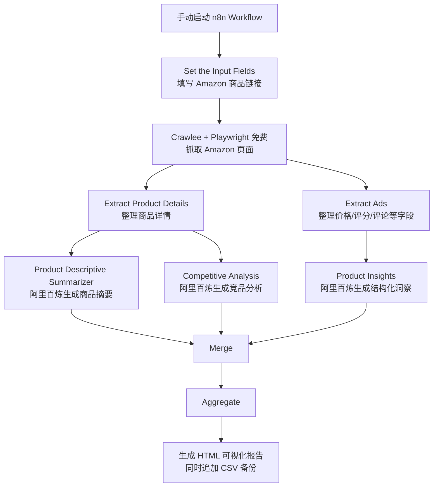

# Amazon 商品情报分析 SOP

版本：Crawlee 免费抓取 + 阿里百炼 + HTML 可视化报告
最后确认时间：2026-05-23
n8n 工作流名称：Amazon 商品情报分析 - Crawlee免费抓取 + 阿里百炼 + HTML报告
n8n 工作流 ID：nRSff4JkGEfBZJJd

## 1. 目标

把一个 Amazon 商品链接自动处理成一份本地 HTML 可视化分析报告，并同步保存 CSV 数据备份。

当前流程重点：

- 免费本地爬虫：Crawlee + Playwright
- 不使用 Decodo
- 不使用 Jina Reader
- 不使用 Google Sheets
- 不使用 OpenAI API
- AI 分析使用阿里百炼 OpenAI 兼容接口，模型为 qwen-turbo
- 输出到本机 HTML 和 CSV 文件

## 2. 最终产物

HTML 最新报告：

```text
C:\Users\96259\Desktop\AIcoding\codex02\AIkuajing\output\amazon_product_analysis\amazon_product_analysis_latest.html
```

历史 HTML 报告目录：

```text
C:\Users\96259\Desktop\AIcoding\codex02\AIkuajing\output\amazon_product_analysis\reports
```

CSV 数据备份：

```text
C:\Users\96259\Desktop\AIcoding\codex02\AIkuajing\output\amazon_product_analysis\amazon_product_analysis.csv
```

## 3. 系统组成

本机一共运行两个 Docker 容器：

```text
n8n
amazon-crawler
```

### n8n

用途：

- 编排整个自动化流程
- 接收商品链接
- 调用本地爬虫服务
- 调用阿里百炼做中文分析
- 汇总结果
- 生成 HTML 报告和 CSV 文件

访问地址：

```text
http://localhost:5678
```

### amazon-crawler

用途：

- 本地免费爬取 Amazon 商品页
- 使用 Crawlee + Playwright 打开页面
- 提取标题、价格、评分、评论数、品牌、五点描述、详情文本等信息
- 返回给 n8n

健康检查地址：

```text
http://localhost:8787/health
```

n8n 内部调用地址：

```text
http://amazon-crawler:8787/scrape
```

## 4. 整体流程图



## 5. 节点说明

### 5.1 When clicking 'Execute workflow'

类型：Manual Trigger

作用：

- 手动启动整个工作流。

### 5.2 Set the Input Fields

类型：Set

作用：

- 存放要分析的 Amazon 商品链接。

核心字段：

```text
product_url
```

使用时只需要替换这里的商品链接。

### 5.3 Crawlee + Playwright 免费抓取 Amazon 页面

类型：HTTP Request

接口：

```text
POST http://amazon-crawler:8787/scrape
```

请求内容：

```json
{
  "url": "={{ $json.product_url }}",
  "timeoutMs": 45000
}
```

作用：

- 调用本地 `amazon-crawler` 服务。
- 用真实浏览器方式打开 Amazon 商品页。
- 返回结构化商品数据。

可抓取字段包括：

- ASIN
- 商品标题
- 价格
- 评分
- 评论数
- 品牌
- 库存状态
- 商品五点描述
- 商品详情
- 分类路径
- 商品图片
- 页面原始文本

### 5.4 Extract Product Details

类型：Code

作用：

- 把爬虫返回结果整理成商品详情结构。
- 给后面的商品摘要和竞品分析使用。

输出重点字段：

- `product_url`
- `asin`
- `title`
- `brand`
- `price_hint`
- `price_number`
- `rating_hint`
- `rating_number`
- `reviews_hint`
- `reviews_number`
- `bullets`
- `product_details`
- `description`
- `raw_page_text`
- `extraction_note`

### 5.5 Extract Ads

类型：Code

作用：

- 把商品页数据整理成原模板可用于“商品洞察”的结构。
- 当前不抓 Amazon 广告数据，因为没有使用 Amazon Ads API。

输出重点字段：

- `total_items`
- `unique_asins`
- `asin`
- `title`
- `brand`
- `price`
- `price_number`
- `rating`
- `rating_number`
- `reviews`
- `reviews_number`
- `availability`
- `categories`
- `bullets`
- `items`

### 5.6 Product Insights

类型：Information Extractor

AI 模型：

```text
阿里百炼 Chat Model for Amazon Product Mining
qwen-turbo
```

作用：

- 输出结构化商品情报。
- 包括价格区间、评论洞察、Prime 覆盖、去重建议、定价策略、Listing 优化建议。

要求：

- 中文输出。
- 数字字段保持数字。
- 缺失字段写“暂无数据”。
- 不编造数据。

### 5.7 Product Descriptive Summarizer

类型：LLM Chain

AI 模型：

```text
阿里百炼 Chat Model
qwen-turbo
```

作用：

- 生成中文商品摘要。

输出内容：

- 产品定位
- 核心卖点
- 主要规格或功能
- 适合人群
- 潜在风险

### 5.8 Competitive Analysis

类型：Information Extractor

AI 模型：

```text
阿里百炼 Chat Model for Competitive Analysis
qwen-turbo
```

作用：

- 生成中文竞品分析。

输出内容：

- 市场定位
- 竞争优势
- 劣势和转化风险
- 标题、五点描述、广告角度
- 跨境卖家选品建议

### 5.9 Merge

类型：Merge

作用：

- 合并三路 AI 结果：
  - 商品洞察
  - 商品摘要
  - 竞品分析

### 5.10 Aggregate

类型：Aggregate

作用：

- 把三路结果聚合成一条记录。
- 交给最后的报告生成节点。

### 5.11 生成 HTML 可视化报告

类型：Code

作用：

- 生成最新 HTML 可视化报告。
- 生成历史 HTML 报告。
- 追加 CSV 数据备份。

输出文件：

```text
C:\Users\96259\Desktop\AIcoding\codex02\AIkuajing\output\amazon_product_analysis\amazon_product_analysis_latest.html
```

```text
C:\Users\96259\Desktop\AIcoding\codex02\AIkuajing\output\amazon_product_analysis\reports\amazon_product_analysis_ASIN_时间.html
```

```text
C:\Users\96259\Desktop\AIcoding\codex02\AIkuajing\output\amazon_product_analysis\amazon_product_analysis.csv
```

HTML 报告展示内容：

- 商品标题
- ASIN
- 生成时间
- 价格
- 评分
- 评论数
- 商品链接
- 商品摘要
- 竞品分析
- 定价建议
- Listing 优化建议
- 数据说明

## 6. 每次使用 SOP

### 步骤 1：确认 Docker 正在运行

打开 Docker Desktop，确认 Docker 已启动。

### 步骤 2：确认两个容器在运行

需要运行：

```text
n8n
amazon-crawler
```

如果 n8n 页面能打开，一般说明 `n8n` 正常：

```text
http://localhost:5678
```

如果爬虫健康检查能打开，说明 `amazon-crawler` 正常：

```text
http://localhost:8787/health
```

正常结果类似：

```json
{
  "ok": true,
  "service": "amazon-crawler-local",
  "crawler": "Crawlee + Playwright"
}
```

### 步骤 3：打开 n8n

浏览器访问：

```text
http://localhost:5678
```

打开工作流：

```text
Amazon 商品情报分析 - Crawlee免费抓取 + 阿里百炼 + HTML报告
```

### 步骤 4：替换商品链接

打开节点：

```text
Set the Input Fields
```

修改字段：

```text
product_url
```

填入要分析的 Amazon 商品链接。

示例：

```text
https://www.amazon.in/Sony-DualSense-Controller-Grey-PlayStation/dp/B0BQXZ11B8
```

### 步骤 5：运行工作流

点击：

```text
Execute workflow
```

等待流程完成。

一般执行顺序：

1. 本地爬虫打开 Amazon 页面
2. 提取商品数据
3. 阿里百炼生成中文分析
4. 合并结果
5. 写入 HTML 和 CSV

### 步骤 6：查看 HTML 报告

打开：

```text
C:\Users\96259\Desktop\AIcoding\codex02\AIkuajing\output\amazon_product_analysis\amazon_product_analysis_latest.html
```

这个文件永远是最新一次运行的报告。

### 步骤 7：查看历史报告

打开目录：

```text
C:\Users\96259\Desktop\AIcoding\codex02\AIkuajing\output\amazon_product_analysis\reports
```

每次运行会生成一个新的 HTML 文件，文件名包含 ASIN 和时间。

### 步骤 8：查看 CSV 数据

打开：

```text
C:\Users\96259\Desktop\AIcoding\codex02\AIkuajing\output\amazon_product_analysis\amazon_product_analysis.csv
```

CSV 字段包括：

- `created_at`
- `asin`
- `product_url`
- `product_title`
- `price`
- `rating`
- `reviews`
- `product_summary`
- `competitive_analysis`
- `pricing_strategy`
- `listing_improvement`
- `html_report`
- `notes`

## 7. 成本说明

免费部分：

- n8n 本机 Docker
- Crawlee
- Playwright
- 本地 HTML 输出
- 本地 CSV 输出

不再使用：

- Decodo
- Google Sheets OAuth
- OpenAI API
- Jina Reader
- 付费代理池
- 付费验证码服务

需要注意：

- 阿里百炼 API 是否扣费，取决于你的阿里云账号免费额度和计费状态。
- 当前模型为 `qwen-turbo`。
- 如果想严格控制费用，需要在阿里云百炼控制台设置额度、预算或确认免费额度。

## 8. 常见问题和处理办法

### 问题 1：HTML 报告没有更新

可能原因：

- 工作流没有完整跑完。
- 最后节点“生成 HTML 可视化报告”没有执行。
- n8n 容器没有挂载输出目录。

处理办法：

1. 在 n8n 中查看最后一个节点是否成功。
2. 检查输出目录：

```text
C:\Users\96259\Desktop\AIcoding\codex02\AIkuajing\output\amazon_product_analysis
```

### 问题 2：价格、评分、评论数显示“暂无数据”

可能原因：

- Amazon 返回了验证码或机器人检测页面。
- 当前商品页面结构和常见结构不同。
- Amazon 地区站点限制访问。
- 页面加载时没有展示价格。

处理办法：

1. 换一个 Amazon 商品链接测试。
2. 稍后重试。
3. 降低运行频率。
4. 手动打开商品页确认是否能正常看到价格和评论。

### 问题 3：爬虫服务打不开

检查地址：

```text
http://localhost:8787/health
```

如果打不开，说明 `amazon-crawler` 容器可能没运行。

需要确认 Docker Desktop 已启动，并确认容器：

```text
amazon-crawler
```

### 问题 4：n8n 打不开

检查地址：

```text
http://localhost:5678
```

如果打不开，说明 `n8n` 容器可能没运行。

### 问题 5：阿里百炼节点报错

可能原因：

- API Key 失效。
- 阿里百炼账号没有可用额度。
- 模型 `qwen-turbo` 权限不可用。
- 网络请求失败。

处理办法：

1. 检查 n8n 凭据：

```text
阿里百炼 OpenAI兼容 API
```

2. 检查 Base URL：

```text
https://dashscope.aliyuncs.com/compatible-mode/v1
```

3. 检查模型：

```text
qwen-turbo
```

4. 到阿里云百炼控制台确认 API Key 和额度。

## 9. 日常维护 SOP

### 每天使用前

1. 打开 Docker Desktop。
2. 打开 n8n：

```text
http://localhost:5678
```

3. 打开爬虫健康检查：

```text
http://localhost:8787/health
```

4. 确认输出目录存在：

```text
C:\Users\96259\Desktop\AIcoding\codex02\AIkuajing\output\amazon_product_analysis
```

### 每次换商品

只改一个地方：

```text
Set the Input Fields -> product_url
```

### 每次运行后

优先看：

```text
amazon_product_analysis_latest.html
```

需要回溯历史时看：

```text
reports
```

需要做表格统计时看：

```text
amazon_product_analysis.csv
```

## 10. 当前版本边界

这个版本适合：

- 单个 Amazon 商品分析
- 选品初筛
- 竞品初步判断
- Listing 优化参考
- 生成中文可视化报告

这个版本暂不适合：

- 大批量高频抓取
- 绕过验证码
- 需要稳定企业级代理池的场景
- 需要官方订单、库存、财务数据的场景
- 需要 Amazon 广告后台数据的场景

如果后续要做批量分析，可以升级：

- 输入改成 CSV 商品链接列表。
- 加 Split in Batches 批量处理。
- 给爬虫加延迟和重试。
- HTML 报告改成总览看板。
- CSV 增加类目、价格带、评分带和机会评分字段。
